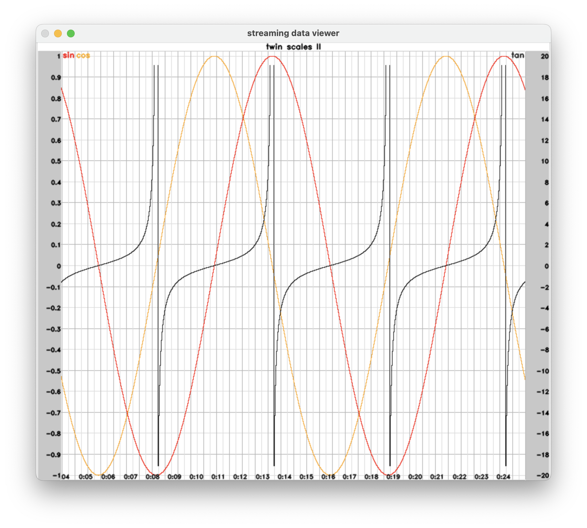

#Cleaning up and preparing a video. Here we go. Hello world !!

# Streamview

View streaming videos and graph data - no configuration needed. 

## Getting Started

Streamview is python based and consists of a viewer application a demo app, and  sample code. The application runs on Linux, MacOS, Windows. The demo app ( used for generating streaming messages ) can be run on a headless computer. The viewer app needs a local display. 

Copy or clone the github repository to install.  Use the demo app to test drive the viewer. 

### Prerequisites

Streamview requires Python 3.8 or better. It makes use of the zqm (https://zeromq.org/ ) messaging library and opencv ( https://opencv.org/ ) 

### Installation

(Note. replace pip for pip3 and/or python for python3, depending on your install )

1. pip install opencv-python
1. pip install pyzmq
2. git clone https://github.com/Robobluez/streamview.git

**start viewer ( receive and render streaming video and graph data ) :** 

python3 streamview.py

**start demo app ( generate sample streaming video and graph data ):** 

python3 demo_full.py

## Instructions

### streamview.py

This is the main application. 

Use the -h command line option for help:View streaming video and graph data

```
View streaming video and graph data

options:
  -h, --help            show this help message and exit
  -width WIDTH          pixel width width of viewer window
  -height HEIGHT        pixel height of viewer window
  -createvideo          save viewer data as video
  -videopath VIDEOPATH  saved video output directory
  -fps FPS              frame rendering speed. applies to both screen rendering and saved video
  -videocolormodel {bgr,rgb,auto}
                        color subpixel order in video input
  -gh GRAPHHOST, --graphhost GRAPHHOST
                        name or address of graph message host
  -gp GRAPHPORT, --graphport GRAPHPORT
                        port number of graph data messags
  -vh VIDEOHOST, --videohost VIDEOHOST
                        name or address of video message host
  -vp VIDEOPORT, --videoport VIDEOPORT
                        port number of video messages
  -gc {1,2,3,4,5}, --graphcols {1,2,3,4,5}
                        number of graph columns
  -vc {1,2,3,4,5}, --videocols {1,2,3,4,5}
                        number of video columns
```

Note. To exit (stop) the application you enter 'q' in the terminal window

The streamview application will display videos and graphs in a grid layout with a configurable number of columns.  Using defaults setttings, or configurable the number of columes with the -gc and -vc command line options. The number of rows and the height of graph rows will automatically adjust depending on space. Videos take priority over graphs - as videos are added, graphs will be auto-sized or hidden. Videos that don't fit within the available grid space will be also be hidden.

Videos, graphs, and time series data (graph variables) are transmitted using a simple streaming data format based on python dicts using the zqm messaging library. See **Message format.**

Streamview will automatically generate dual y-scales ( left side and right side ) and, gridlines and y-axis labels. The scales can be independently configured and have a default range of -1 to 1. Dual y-axes allow visualization of time series with different y-value ranges. Display values that fall outside the specified y-scale ranges will not be displayed. The streaming message format allows time series data variables to be assigned to either the left or right y-axis.

Streamview provides the ability to display data values as text. This means you can view the exact value, such as 'battery dc: 12.7V', instead of having a  visual representation.


### demo_full.py

This program generates mock streaming video and graph data and can be used to test and preview the behaviour of the viewer application.  After starting it, select the graphs or videos to stream by entering the corresponding selection key ( a, b, c, etc  )

```
Use stream viewer app to view the results

Graphs:
a : twin scales I 
b : twin scales II 
c : graph plus data variables 
d : data variables only 
e : lots of graph variables 
Videos:
A : video simulation (small I)  
B : video simulation (small II)  
C : video simulation (medium I) 
D : video simulation (medium II) 
E : video simulation (medium III) 
F : video simulation (large) 

Enter selector for graph/video to stream or q to quit : 
```

Note. To stop the application, enter 'q'


### demo_simple.py

This program is included to illustrate the basics of data generation for streamview.

```
import zmq
import math
import time
import random
import cv2
import numpy as np

context = zmq.Context()

# video data
sock_vid    = context.socket(zmq.PUB) # publish to whoever is listening
sock_vid.setsockopt(zmq.CONFLATE, 1)  # keep latest message only
sock_vid.bind("tcp://*:5550")         # send to port 5550 on local network interface

#graph data
sock_graph    = context.socket(zmq.PUB) # publish to whoever is listening
sock_graph.setsockopt(zmq.CONFLATE, 1)  # keep latest message only
sock_graph.bind("tcp://*:5551")         # send to port 5551 on local network interface

idx = 1

print("Streaming. Interrupt to stop")

# simulate time series data in while loop
while True:

	# create a single data message with data for two graphs
    graph =  \
        {    \
             "minimal graph" :   # graph name
            (
                { "min" : -1, "max" : 1}, # left scale range
                { "sin" : math.sin(math.radians(idx)) }, # single left side var
                {}, # no right scale range
                {}, # no right scale vars
                {}  # no data data variable
            ),
             "full graph" :   # graph name
            (
                {"min" : -1, "max" : 1}, # left scale range
                { # left scale vars
                   "sin" : math.sin(math.radians(idx)),
                   "cos" : math.cos(math.radians(idx))
                },
                {"min" : -20, "max" : 20}, # right scale range
                { "tan" : math.tan(math.radians(idx)) }, # right scale var
                {"idx" : idx} # data variable
            )
        }


    # prepare a simulated moving image
    win = np.full((240,240,3), 0, dtype=np.uint8)
    cv2.circle(win, (random.randrange(win.shape[1]), random.randrange(win.shape[0])),
        int(random.randrange(win.shape[0])/5), (255,0,255), -1)

	 #stream the video and graph data, each in different ports. that's it !	
    sock_graph.send_pyobj(graph) # stream graph data
    sock_vid.send_pyobj({"demo video" : win} )  # stream video data

    time.sleep(0.04) # wait a bit ( so we run at approx 25 frames per second
    
    idx += 1

```

Note. Unlike streamviewer and the demo_full application, to quit this program, use control^C.

## Streaming

For (networked) streaming support, streamview makes use of zqm ( see [https://zeromq.org](https://zeromq.org/) ) a well supported, well documented network streaming framework available on all common OS'es, with bindings available for all common programming languages. 

Video and graph messages are sent over different ports for convenience, so that they can be independenly sent by different processes. 

Messages are exchanged using the publish–subscribe pattern

If necessary, the messaging layer can be easily replaced, or changed to use a different format or a different messaging model. 


## Message format

Messages are encoded as python dictionaries.  
#### video messages

Videos are encoded as key value pairs, the key being the video stream name and the value being the individual streaming video frames as array. 

Composition of a single video frame is as simple as:

```
message  = {"demo frame" : np.full((240,240,3), 0, dtype=np.uint8)} )  
```

#### graph data messages

Graph visualize streaming time series data. Time series data points are implemented as key value pairs, the key being the name of the graph and the value being tuples containing the payload. 

Graph messages payloads include the definition ( = min and max value ) of each of the left side and right side y-axis, and the associated variables and values.  In addition, graphs may have a set of data variables - variables for which values are displayed as text rather than visualized. Each of these - the left and right y-axis definition, associated variables and values, and data variables, are separate dicts.

Example of a graph data message: 

```
message = {
    "twin scales II": (  # graph name
        {"min": -1, "max": 1},  # left scale range
        {  # left scale vars
            "sin": math.sin(math.radians(idx)),
            "cos": math.cos(math.radians(idx)),
        },
        {"min": -20, "max": 20},  # right scale range
        {"tan": math.tan(math.radians(idx))},  # right scale var
        {"idx": idx},  # data variable
    )
}

```
## Screenshots

Rendering corresponding with above graph sample data:
 
 
 Example generated with demo_full.py:
 
 
 Sample data generated by robot:
 


## Author

Robobluez@gmail.com

## License

This project is licensed under the MIT License - see the [LICENSE.md](LICENSE.md) file for details

## Acknowledgments

* Georgia Tech's OMSCS program for sparking my interest in robotics.
* NASA, for bringing us the ingenuity, the little helicopter that could. Used for animated video in the sample app.

